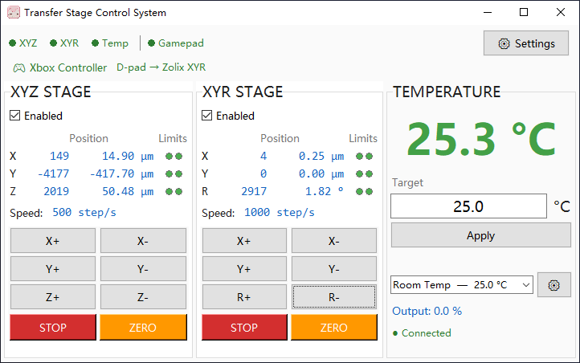

# Transfer Stage Control System

A Windows desktop application for controlling a **2D material transfer system** with
three instruments. Control via **keyboard**, **Xbox-compatible gamepad (XInput)**,
and **on-screen buttons**.



## Instruments

| Instrument | Controller | Protocol | Default Baud
|---|---|---|---|
| **SigmaKoki XYZ Stage** | Arduino (ATmega328P) | Text commands over USB UART | 115200
| **Zolix XYR Stage** | ZC300 | MODBUS-RTU over RS-485 | 115200
| **Yudian AI-828** | AI-828 | MODBUS-RTU over RS-485 | 9600

## Features

- Simultaneous 3-axis control per stage with independent software enable/disable
- Keyboard, gamepad (XInput), and on-screen button input — all usable simultaneously
- **Analog stick** for proportional speed control (left stick → XYZ, right stick → XYR)
- **Short press** = single-step / **long press** (≥300ms) = continuous motion
- **Speed modifiers**: Shift key (keyboard) / triggers (gamepad) toggle fast mode
- Real-time position display in **steps** and **µm / degrees** (configurable conversion)
- Per-axis speed and step settings (XY, Z, R independently configurable)
- Limit switch indicators for all axes
- Temperature monitoring with configurable presets and safety limits
- Gamepad hot-plug support (XInput, zero dependencies)
- Settings stored as JSON alongside the executable
- Builds to a single `.exe` via PyInstaller

---

## Controls Reference

### Keyboard

| Input | Stage | Axis | Direction | Notes
|---|---|---|---|---|
| **W** | SigmaKoki | Y | Positive (+) | Hold Shift for fast
| **S** | SigmaKoki | Y | Negative (−) |
| **A** | SigmaKoki | X | Negative (−) |
| **D** | SigmaKoki | X | Positive (+) |
| **↑** (Up) | Zolix | Y | Positive (+) | Hold Shift for fast
| **↓** (Down) | Zolix | Y | Negative (−) |
| **←** (Left) | Zolix | X | Negative (−) |
| **→** (Right) | Zolix | X | Positive (+) |
| **Q** | Zolix | R (rotate) | Negative (−) |
| **E** | Zolix | R (rotate) | Positive (+) |
| **U** | SigmaKoki | Z | Positive (+) |
| **J** | SigmaKoki | Z | Negative (−) |
| **Shift** | — | — | Fast speed | Hold while pressing direction keys
| **Esc** | — | — | **STOP ALL** | Emergency stop — stops both stages

### Gamepad (Xbox layout)

#### Sticks

| Control | Stage | Axes | Behavior
|---|---|---|---|
| **Left Stick** | SigmaKoki | X / Y | Analog speed — continuous, proportional to deflection
| **Right Stick** | Zolix | X / Y | 8-direction — wide cardinals, narrow diagonals

#### D-Pad

| Button | Stage | Axis | Direction | Notes |
| --- | --- | --- | --- | --- |
| **D-Pad ↑** | Current stage¹ | Y | Positive (+) | Long press → continuous |
| **D-Pad ↓** | Current stage¹ | Y | Negative (−) | Short press → single step |
| **D-Pad ←** | Current stage¹ | X | Negative (−) | |
| **D-Pad →** | Current stage¹ | X | Positive (+) | |

¹ D-pad stage toggles between SigmaKoki and Zolix via **Back** button.

#### Face Buttons

| Button | Stage | Axis | Direction | Notes |
| --- | --- | --- | --- | --- |
| **A** | SigmaKoki | Z | Positive (+) | Long press → continuous |
| **B** | SigmaKoki | Z | Negative (−) | Short press → single step |
| **X** | Zolix | R (rotate) | Negative (−) | |
| **Y** | Zolix | R (rotate) | Positive (+) | |

#### Triggers & Special

| Button | Action
|---|---|
| **Left Trigger (LT)** | Fast speed for SigmaKoki (left stick, D-pad, face buttons A/B)
| **Right Trigger (RT)** | Fast speed for Zolix (right stick, D-pad, face buttons X/Y)
| **Back** | Toggle D-pad stage assignment (SigmaKoki ↔ Zolix)
| **Start** | Toggle enable/disable for the D-pad-assigned stage

---

## On-Screen UI

Each stage panel has a 4×2 directional button grid with press-and-hold continuous
and click-for-single-step behavior:

```
 X+ │ X-
 Y+ │ Y-
Z+/R+│Z-/R-
STOP│ZERO
```

- **STOP** — global emergency stop (both stages, all axes)
- **ZERO** — reset position counters to zero at current location (no physical movement)
- **Enabled** checkbox — software enable/disable per stage; disables ALL inputs for that stage

---

## Speed Configuration

Each axis pair has independently configurable slow and fast speeds:

| Setting | Stage | Axes
|---|---|---|
| XY Slow / Fast | Both | X, Y
| Z Slow / Fast | SigmaKoki | Z
| R Slow / Fast | Zolix | R

Fast mode is activated by:
- **Keyboard**: holding **Shift**
- **Gamepad**: holding the stage's trigger (**LT** for SigmaKoki, **RT** for Zolix)

Speed changes mid-hold (pressing/releasing Shift or trigger) take effect immediately
for gamepad controls. For keyboard, release and re-press the key to apply the new speed.

---

## Position Display

The status table shows positions in two units side by side:

| Axis | Steps | µm / °
|---|---|---|

- **Steps** — raw pulse count from the controller
- **µm** (linear axes) or **°** (rotation axis) — converted physical units

Configure conversion factors in **Settings → Display**:
- **XY µm/step** — shared by X and Y linear axes
- **Z µm/step** — SigmaKoki Z axis (often different pitch / microstepping)
- **R °/step** — Zolix rotation axis

---

## Settings

Access via the **⚙** button in the status bar. Settings are saved to `settings.json`
alongside the executable (auto-generated on first run).

### Tabs

| Tab | Contents
|---|---|
| **SigmaKoki XYZ** | COM port, baudrate, speed, step, display, axis inversion
| **Zolix XYR** | COM port, baudrate, slave address, speed, step, display, axis inversion
| **Temperature** | COM port, baudrate, slave address, safety limits
| **Gamepad** | Trigger threshold, stick inversion
| **Input** | Long-press threshold, loop rate, status poll rate

---

## Hardware Setup

1. **SigmaKoki XYZ**: Arduino Nano/Uno with `transfer_stage_controller.ino`
   firmware uploaded. Connect via USB — appears as a COM port.
2. **Zolix XYR**: ZC300 motion controller. Connect via USB (or RS-485 adapter)
   — appears as a COM port. Ensure MODBUS slave address matches.
3. **Yudian AI-828**: Connect via USB-to-RS485 converter — appears as a COM port.
   Ensure MODBUS slave address matches and AFC=0 or AFC=2.

Configure COM ports and slave addresses in the Settings dialog.

### Arduino Firmware

Upload the firmware from `arduino_firmware/transfer_stage_controller/` to your
Arduino Nano/Uno (ATmega328P, 16 MHz). Pin assignments and protocol details are
documented in the `.ino` header.

```bash
# Using Arduino CLI
arduino-cli upload -p COMx -b arduino:avr:nano \
  arduino_firmware/transfer_stage_controller/transfer_stage_controller.ino
```

---

## Development

### Requirements

- Python 3.12+
- `pyserial`
- `tkinter` (bundled with Python on Windows)
- Conda environment recommended

```bash
conda env create -f environment.yml
conda activate transfer_stage
python main.py
```

### Build .exe

```bash
# From project root
conda activate transfer_stage
pyinstaller --clean --noconfirm build_scripts/transfer_stage.spec
```

Output: `dist/TransferStageControl.exe`

You can also run the convenience script:

```bash
build_scripts/build.bat
```

---

## Project Structure

```
transfer_stage_app/
├── main.py                    # Entry point
├── app.py                     # Application bootstrap + logging setup
├── environment.yml            # Conda environment spec
│
├── arduino_firmware/          # Arduino .ino for SigmaKoki XYZ stage
├── stage_control/             # Hardware drivers + instrument manager
│   └── hardware/              # sigmakoki.py, zolix.py, yudian.py
├── input_system/              # Keyboard, gamepad (XInput), action resolver
├── gui/                       # tkinter UI panels (stage, temperature, settings)
├── utils/                     # Config, logging, MODBUS-RTU, serial utilities
├── build_scripts/             # PyInstaller spec, version info, build.bat
├── icon/                      # Application icons
├── img/                       # Screenshots
└── docs/                      # Planning docs, requirements, hardware reference
    └── hardware/               #   Instrument manuals, old reference code
```

---

## License

This project is licensed under the **MIT License** — see [LICENSE](LICENSE) for the full text.

### Third-Party Licenses

This project uses the following open-source libraries:

| Library | Version | License
|---|---|---|
| [pyserial](https://github.com/pyserial/pyserial) | 3.5 | BSD 3-Clause
| [PyInstaller](https://github.com/pyinstaller/pyinstaller) | 6.3 | GPL with linking exception

**pyserial** — Copyright (c) 2001-2020 Chris Liechti. Redistribution and use in
source and binary forms, with or without modification, are permitted provided
that the above copyright notice appears in all copies.

**PyInstaller** — The PyInstaller bootloader is licensed under GPLv2+ with a
special linking exception that permits bundling with non-GPL applications
(including proprietary ones). The compiled `.exe` output of this project may
be distributed under the MIT license.
